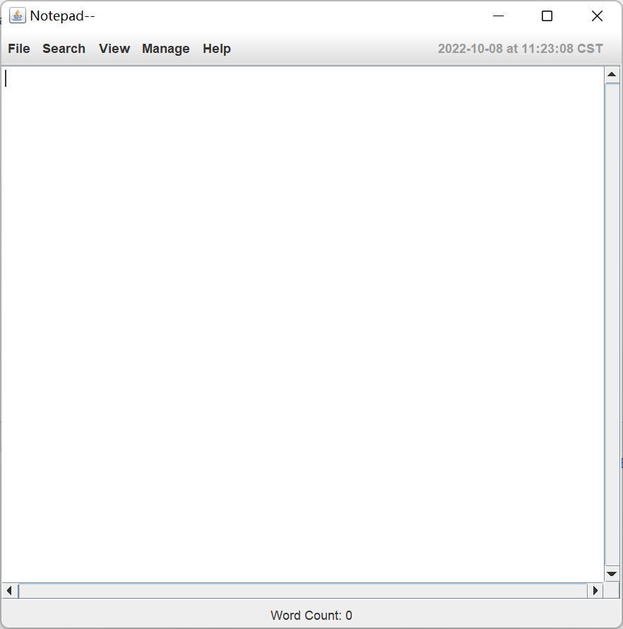

## Notepad--

<!--159.251 - Software Design and Construction-->

<!--Assignment 1 - 2022-->

<!--Using Java to make a text editor!-->

#### 1. Contributors

Member I : Zheng Wang, ID: 21012737 (Submit README.MD)

Member II : William Wu, ID: 21012743 (Submit the Source code)

#### 2. Instructions

1. First clone this repository into your local computer.

`git clone https://gitee.com/postlude/notepad.git`

2. You can open this project in any IDE. Run this maven project. When build succeeds, run the "notepad.class" and you will see the notepad program. Just like the one below.

   

   Files in the repository:

   1. YAML folder-- used to store the YAML configuration files.

   2. src folder-- includes the source codes and test codes and test resources

   3. pom.xml -- Maven configuration file

#### 3. Significant commits

Member I, Zheng Wang

1. ID: 4f2d6cf5e433048c7b446c02778e73ab67c61343

   Implemented the main Frame, then add functions to display time&data and current row&column.

2. ID: 1b4e652e4e50d35ea825bb19edff9e8b97fea0ae

   Optimize the display of the status bar. Add a function to hide/show it.

3. ID: 29a8422fb99bf26ab9420df10077ad0984733cf8

   Implemented popMenu, it's a little hard to deal with the position when it pops.
   Center the frames when they show up.

4. ID: bc6809e18a972ddd29051f23ae251b5cb59d2a90

   Finally implemented the search function.

5. ID: 8a3ace75f92d0332e2fc1903d9c253aa1a34447c

   Fix bugs in the search method, and add the function to count words.

6. ID: 9ac79886d0323fe508924dbf83226bde985b404d

   Add the function to adjust the font-size of JTextPane (Ctrl + wheel-up/down)

7. ID: a1fefbaea50e5e5215852a73f911f58b5cf27c2b

   Implemented the function to read source code files, though it is actually elementary.
   A really challenging task!

8. ID: ea1e61c281ef6f104cbd5c4fe1578de8b18bd2db

   Dramatically, I replaced JTextArea with JTextPane when implementing the function to read source code.
   And this led to a disaster! Functions to show the current row&column and search by keywords all break down. 
   I removed the former. As for the latter, I had to specify the difference between JTextArea and JTextPane when use 
   .getText() then process the String to adapt the original searching algorithm. It took me a whole afternoon to fix it
   and fortunately, my efforts were not in vain.

   Add searchMethodTest, T&DTest and WordCountTest.

9. ID: ea069fc7cb9ee84b61fc76eec8444930212aad9c

   Implemented an experimental function that can open files when dragging from other windows to our JTextPane.

10. ID: 92d56a815bb95f6be21c76f1c5ece32f2ced7a9c

    The new experimental function found that conflict to paste&copy&cut because of class TransferHandler, from now I
    have no idea to deal with it so I add a new branch to submit.

Member II, William Wu

1. ID: 45dc09e1033eea96840d2385a314dbbdb32134a8

   Implemented two JUnit tests

2. ID: eb742f3ed80cea11bfa4fc63e6cd5ebb40e68172

   Using YAML to configure the project

3. ID: 9f74d8285eacc23b8a375499f8690ab4599ee0ad

   Implemented the functionality of reading RTF files

4. ID: 456db2abf6a1c0ddfc23a13427764655625a7fd4

   Implemented the functionality of reading ODT files

5. ID: aa53e04d4e81d1d14d17ec9d62f4f4ebe268e11e

   Implemented the save functionality

6. ID: a0977bb9019ef369b77521692d0fd206b628c3e6

   Implemented the new functionality

7. ID: 1500d09dfa41c8a30e77dbfce5f49085d8e822f2

   Implemented the export functionality

8. ID: e4173ebe2afae3f82e8312fd84310c5bb8a8218c

   Implemented the selectAll, copy and cut functionalities

9. ID: bae001fd30179eddbd60972a474df64405a9d2a5

   Implemented the print functionality

10. ID: 92d56a815bb95f6be21c76f1c5ece32f2ced7a9c

    Add YAML dependency

#### 4. Interesting features and something worth mentioning

1.After finishing the basic tasks, we use class TransferHandler to add a new function called "Drag and Drop". If the user drags a single file in the range of JTextPane, the file will be read the same as using open function. When the dragging action is finished, the class Dataflavour will get absolute address of the file. We use the absolute address to read the content of it. 

However, we use the built-in copy&cut&paste functions in class Tookit which also call class TransferHandler which flict with "Drag and Drop". We have to build a new branch to store this change temporary.

2.Our testing file contains 5 tests to evaluate open, save, search, time, and Word Count functions respectively. It all call our class notepad which extends JFrame and can pass locally. However, we meet error massage "No X11 DISPLAY variable was set" when using "mvn test" on both gitee and github CI  so I just run "mvn compile" on CI tool.
